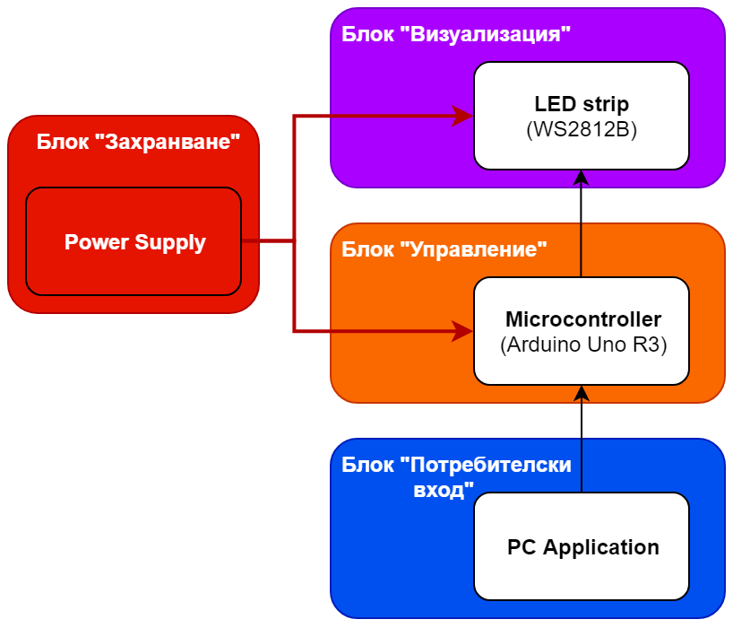
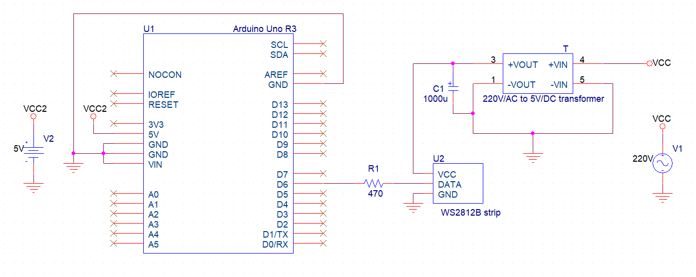

# Визуализатор на музика Music visualizer

# [Официална документация](./Documents/MusicVisualizer_Documentation_Iliyan_Antov.pdf)
# [Презентация на проекта](https://docs.google.com/presentation/d/1Hubuf1_2Yw28AFvXF5u0pnuvvKj3GJBz7yWSgTEtRgM/edit?usp=sharing)

*Визуализатор на музика, базиран на WS2812B лента LED пиксели. С помощта на собствен алгоритъм за засичане на ритъм (Beat detection algorithm), базиран на анализ на Фурие (FFT), приложението изпраща информация към микроконтролер Arduino Uno R3. Предаването на информация става посредсвром серийна връзка през USB кабел и собствен протокол. Микроконтролерът обработва информацията и визуализира ритъма върху свързаната към него лента LED пиксели.*

## Демонстрация (Demo):

## Блок схема:

## Електрическа схема:

## Използвани технологии:

* [C/C++ (Arduino)](https://www.arduino.cc/reference/en)
* [Arduino Uno R3](https://www.arduino.cc/reference/en)
* [WS2812B](https://cdn-shop.adafruit.com/datasheets/WS2812B.pdf)

## Автор:

Илиян Антов - [Iliyan Antov](https://github.com/IliyanAntov) - [i.antov2@gmail.com](i.antov2@gmail.com)
